# 🔥 Firewall & Intrusion Detection System (IDS) Project

## 📌 Overview

This project demonstrates a **Firewall + Intrusion Detection System (IDS)** designed to monitor network traffic, detect malicious activities, and enforce security rules in a simulated environment. It is built for understanding real-world **SOC (Security Operations Center)** monitoring and network defense mechanisms.

The system simulates how enterprise security infrastructure detects and responds to cyber threats such as port scanning, brute-force attacks, and suspicious network behavior.

---

## 🎯 Objectives

* Implement firewall-based network traffic filtering
* Detect malicious activities using IDS techniques
* Monitor and analyze network packets in real time
* Simulate common cyberattacks in a controlled environment
* Generate logs for security analysis and incident response

---

## 🛠 Tools & Technologies Used

* Kali Linux (Attack simulation environment)
* Firewall (iptables / system firewall rules)
* IDS concepts (rule-based detection)
* Wireshark (Packet analysis)
* Nmap (Port scanning simulation)
* Hydra (Brute force attack simulation)
* Log monitoring tools

---

## 🏗 System Architecture

```
Attacker Machine (Kali Linux)
        ↓
Network Traffic (Simulated Attacks)
        ↓
Firewall Layer (Traffic Filtering Rules)
        ↓
IDS Engine (Traffic Monitoring & Detection)
        ↓
Log Analysis & Alert Generation
```

---

## ⚙️ Implementation Workflow

### 1. Firewall Configuration

* Configured firewall rules to allow/deny specific traffic
* Blocked suspicious IP addresses and ports

### 2. Traffic Monitoring

* Captured network packets using Wireshark
* Analyzed incoming and outgoing traffic patterns

### 3. Intrusion Detection

* Identified abnormal network behavior
* Detected repeated login attempts and port scans

### 4. Attack Simulation

* Performed controlled attacks using:

  * Nmap (Port scanning)
  * Hydra (Brute force login attempts)

### 5. Logging & Analysis

* Generated logs for all network events
* Analyzed attack patterns and system response

---

## 🚨 Attack Scenarios Simulated

### 🔍 1. Port Scanning Attack

* Tool Used: Nmap
* Objective: Identify open ports and services
* Detection: Firewall/IDS flagged multiple connection attempts

### 🔐 2. Brute Force Attack

* Tool Used: Hydra
* Objective: Attempt multiple login credentials
* Detection: Repeated failed login attempts logged and flagged

### 📡 3. Suspicious Traffic Monitoring

* Tool Used: Wireshark
* Objective: Analyze abnormal packet flow
* Detection: Unusual traffic patterns identified

---

## 📊 Key Features

* Real-time network monitoring
* Rule-based intrusion detection
* Firewall-based access control
* Attack simulation environment
* Log-based security analysis

---

## 📸 Screenshots

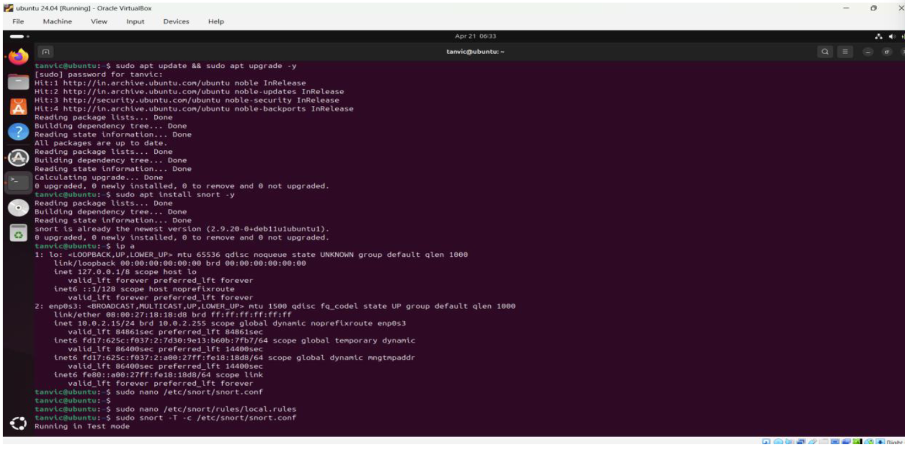
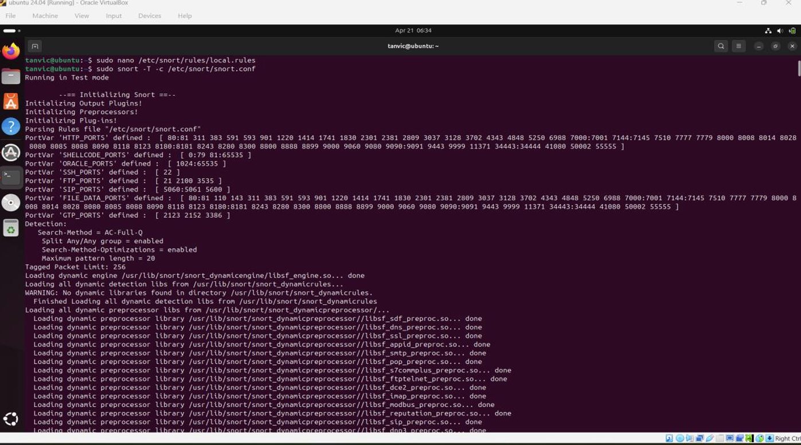
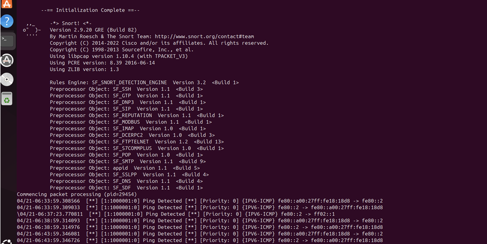
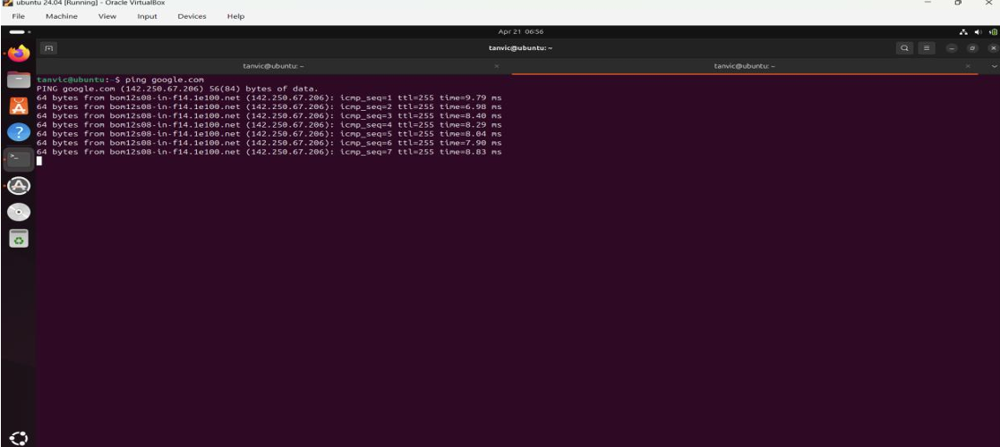
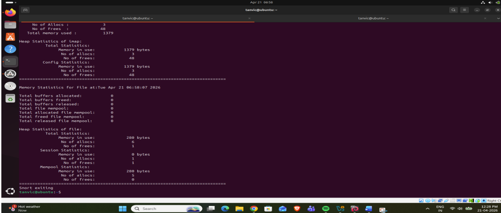
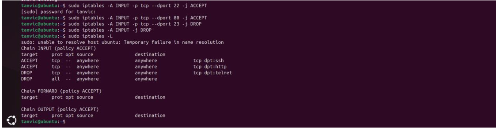
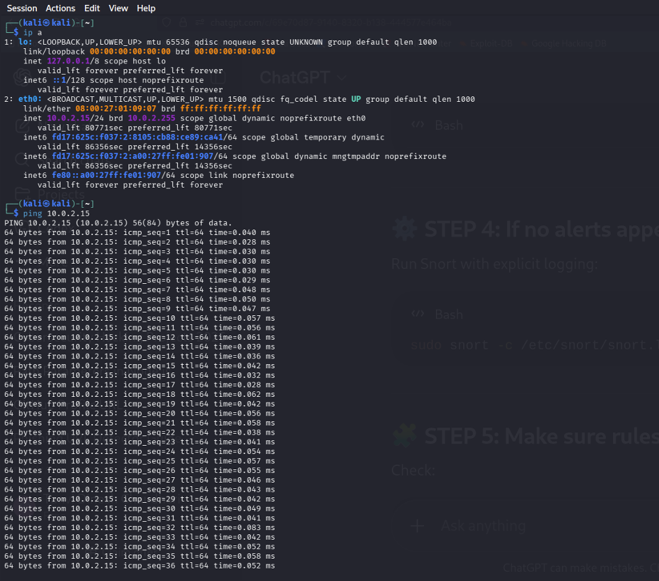
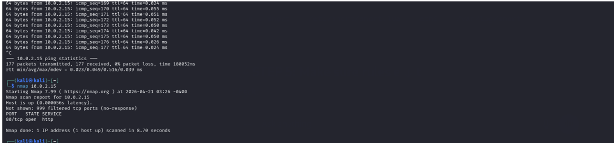
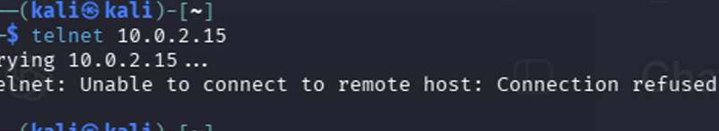
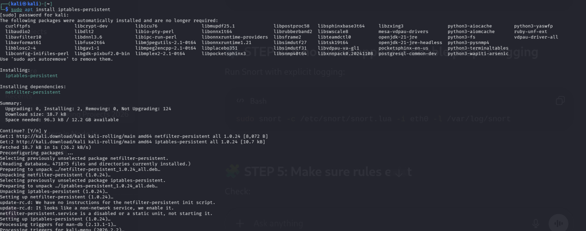
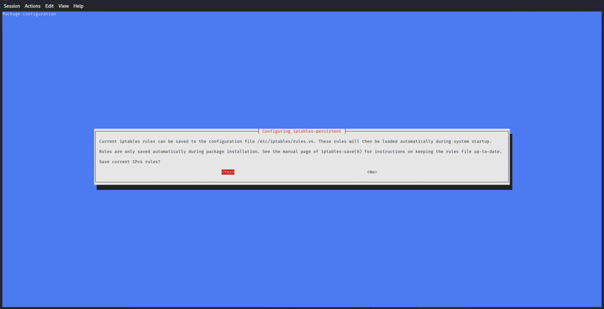
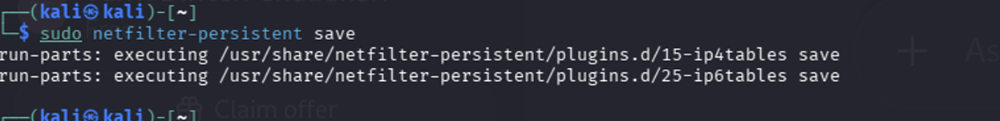

---

## 📚 Key Learnings

* Understanding of network security fundamentals
* Hands-on experience with firewall configuration
* IDS detection techniques and log analysis
* Practical exposure to cyber attack simulation
* Improved understanding of SOC workflows

---

## ⚠️ Disclaimer

This project is developed strictly for **educational and learning purposes only** in a controlled lab environment. No real-world systems were targeted or harmed.

---

## 👩‍💻 Author

**Tanvi Dinesh Chaudhari**
Cybersecurity Student | SOC & Pentesting Enthusiast

---

## 🚀 Future Improvements

* Integration with SIEM tools (Splunk / ELK)
* Machine Learning-based anomaly detection
* Automated alert system
* Advanced threat intelligence mapping (MITRE ATT&CK)
